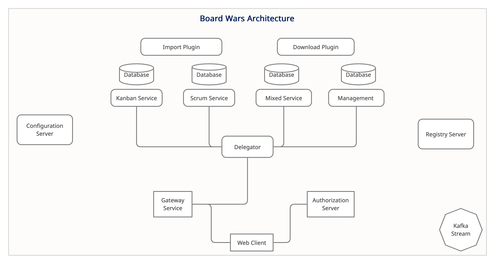

[Showcase](docs/showcase){: .btn .fs-5 .mb-4 .mb-md-0 }             [GitHub](https://github.com/belovedbb/Board-wars){: .btn .fs-5 .mb-4 .mb-md-0 }

---

<!-- ABOUT THE PROJECT -->  
## 🦋About Board Wars  
Board Wars is a tool which provides Agile based methodologies as a medium of project management, it is highly reactive, uses cloud native patterns for high availability and features  complete API spec for an application development.   It is developed with micro-service architecture in mind thereby facilitating loosely coupled services interacting with themselves.
  
There are many great Project Management tools available, this is just an attempt to produce something fast and cloud native centric while still not losing the benefit of the functionality.  
```  
Note, this is an Experimental Version 1, therefore there are many critical features missing at this point 
```  

##### Benefits:  
* Helps with managing complex projects with different sub tree-like modules/tasks.  
* Can be extremely fast since it makes use of reactive principle  
* Provides detailed overview of projects, tasks of the methodology used.  

##### Architecture:  
  Board wars uses Micro service architecture for interaction between services. It also features cloud native patterns like Circuit Breaker, Bulkhead, Fallback pattern.
   
The following are the key features of Board wars architecture:

  *	Microservice Architecture.
  *	Kafka as Message broker for stateless event log.
  *	Hypermedia as the Engine of Application State (**HATEOAS**).
  *	Cloud Native Patterns like Circuit Breaker, Bulkhead Pattern, Rate Limiter, Time Limiter and Fallback Methods.
 <p align="center">    
  <a href="#" title="Board Wars A">    
       
  </a>    
</p>   
  
---
### 👷Built With  
* Java
* Spring Webflux
* Angular
* Kafka
* Mongodb
* Ngx Admin

Check [this]({{ site.baseurl }}#backend-link) out for building the application
---

## About the project

Board Wars is &copy; 2021-{{ "now" | date: "%Y" }} by [Oluwadare Beloved](#).

### License

Just the Docs is distributed by an [MIT license](https://github.com/belovedbb/Board-wars/tree/master/LICENSE.txt).

